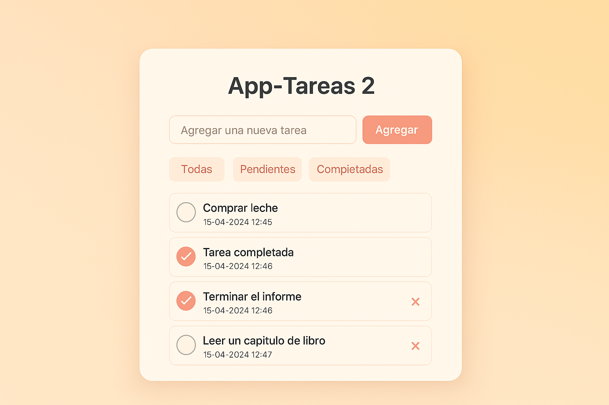
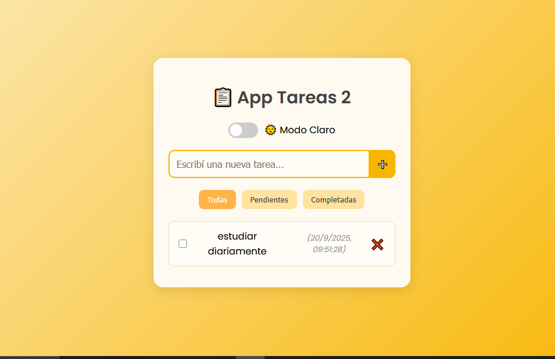
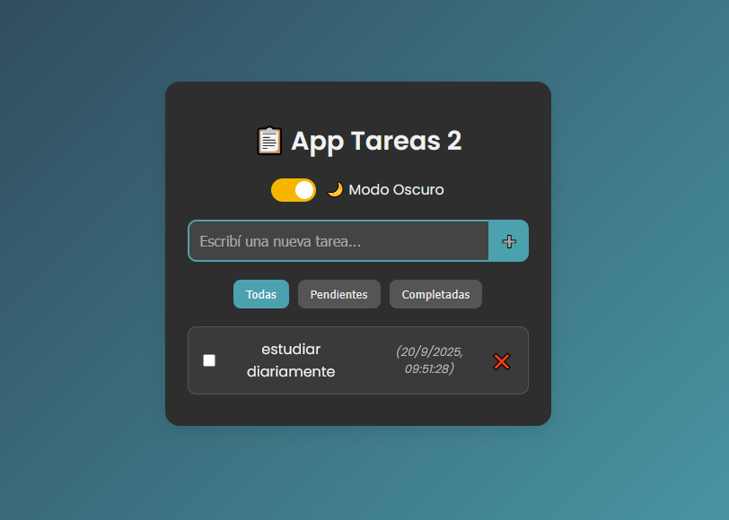

# 📋 App Tareas 2

Un **gestor de tareas simple y atractivo** desarrollado con **HTML, CSS y JavaScript**, que permite agregar, editar, completar y eliminar tareas.  
Incluye **filtros dinámicos**, almacenamiento en **LocalStorage**, **animaciones** y un **modo claro/oscuro** para mejorar la experiencia visual.

---

## 🚀 Funcionalidades

- ➕ Agregar nuevas tareas con fecha y hora automática.  
- ✏️ Editar tareas con doble clic.  
- ✅ Marcar tareas como completadas.  
- ❌ Eliminar tareas con animación.  
- 🔎 Filtrar por **todas, pendientes o completadas**.  
- 💾 Guardado automático en **LocalStorage**.  
- 🌗 Cambiar entre **modo claro/oscuro** con un switch.  
- 📱 Diseño responsive (PC y móviles).  

---

## 📂 Estructura del proyecto

app-tareas-2/
│── index.html   # Estructura principal
│── style.css    # Estilos (claro/oscuro + responsive)
│── script.js    # Lógica en JavaScript
│── README.md    # Documentación
│── assets/      # Capturas de pantalla

---

## 📸 Capturas de pantalla

  
  
  

---

## 🛠️ Cómo ejecutar el proyecto

1. Cloná el repositorio:  
   git clone https://github.com/TU-USUARIO/app-tareas-2.git

2. Entrá en la carpeta del proyecto:  
   cd app-tareas-2

3. Abrí el archivo index.html en tu navegador.  
👉 No se necesita instalar nada más, ya que es un proyecto con HTML, CSS y JS puro.  

---

## 👨‍💻 Autor

Desarrollado por **Ponce Ricardo Andrés** 🚀  
Proyecto creado con fines de práctica y aprendizaje.
